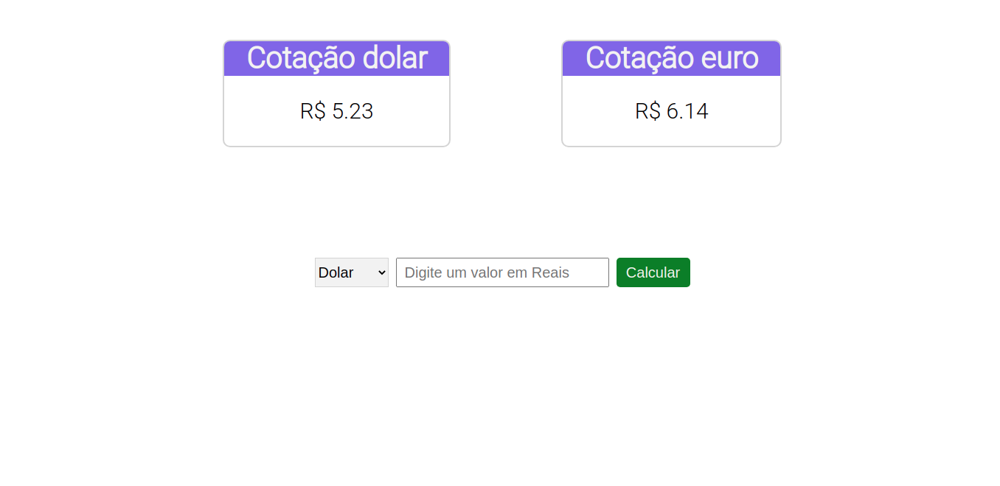

<h1>Aplicativo Cotação :dollar: :euro:</h1>

<h2>Descrição :notebook:</h2>

Um site simples que pega a cotação do dolar e do euro, para converter valores em reais.

Uma <a href="https://docs.awesomeapi.com.br/api-de-moedas#legendas">API</a> foi usada para buscar os dados de cotação. Quando a página é aberta pela primeira vez, o site faz uma consulta na API e salva as informações retornadas na sessão atual. Se a página for recarregada, o site vai utilizar as informações já salvas na sessão.

<h2>Tecnologias usadas :computer:</h2>

* HTML
* CSS
* JavaScript